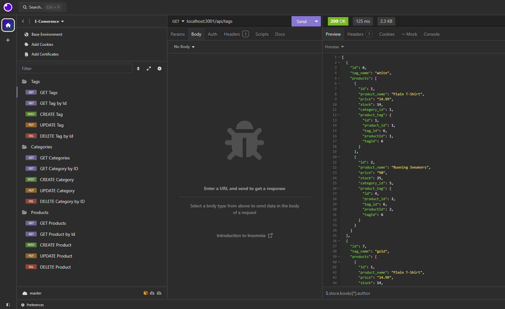

# E-Commerce

## Description

Server-side code for an e-commerce website.

## Installation

In the terminal, use command ````npm install```` to install dependencies. 

## Usage

This application allows a user to run the server-side of an e-commerce website to add, delete, and update products, categories, and tags, in order to track inventory for their store.

This video shows the server-side functionality of the web application: [E-COMMERCE APP VIDEO](https://drive.google.com/file/d/1acwcBeRrc7kZusIyzqTDgCWT_U01wr9_/view?usp=sharing)

Here is a screenshot of the application being run through Insomnia:



Users may use this application to:

+ Get all tags, categories, or products
+ Get one tag, category, or product by it's id
+ Create a new tag, category, or product
+ Update an existing tag, category, or product
+ Delete a tag, category, or product

## Credits

This web application was made by Hannah Belle. See my [GitHub profile.](https://github.com/hannahschwen)

## License

MIT Lisence
